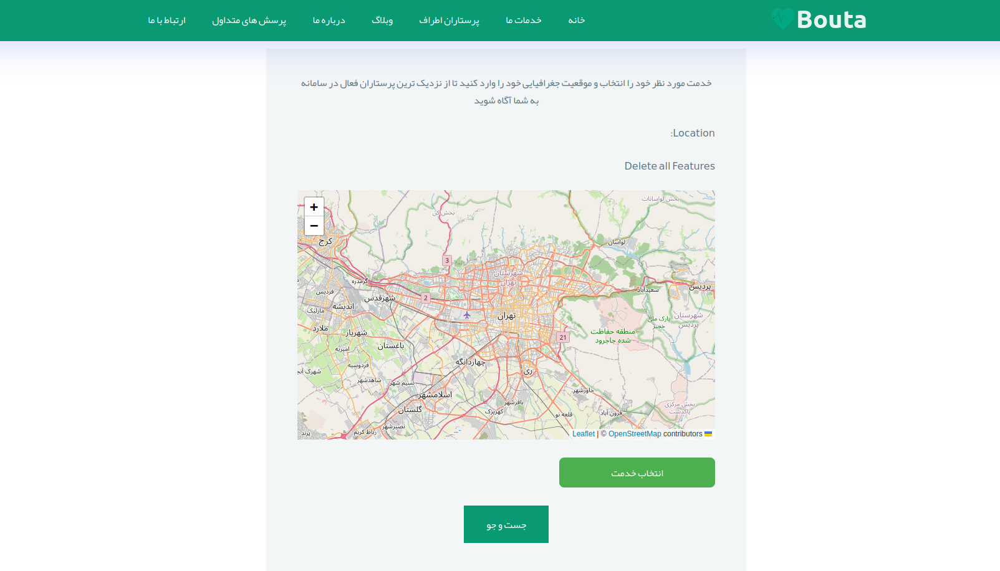

# Bouta
Uber for nurses - GIS project.

## Overview

Bouta is a location-based nursing service platform designed around geospatial search and computation. It connects patients with nearby nurses based on their location and the nursing services they require, using a GIS-driven backend to process and rank geographically relevant results.

The platform provides complete workflows for both patients and nurses, allowing them to interact with the system throughout the service process, from discovering and requesting nursing services to managing requests, completing services, and providing feedback.

The project focuses on handling complex location-based queries efficiently through spatial database indexing, optimized query strategies, caching, and careful data-access design. 

The GIS layer also requires system-level geospatial dependencies and a compatible server environment, making the underlying operating system and infrastructure an important part of running the project.


<p align="center">
  
</p>

<p align="center">
  <em>Home page</em>
</p>

<p align="center">
  
</p>

<p align="center">
  <em>Nurse search and location-based matching</em>
</p>


## Features

- **User and Nurse Registration** — Separate registration and profiles for patients and nurses.
- **Nurse Professional Profiles** — Nurses can manage their descriptions, work history, working hours, skills, services, and pricing.
- **Location-Based Nurse Search** — Patients can search for nearby nurses based on their location and required nursing services.
- **Nursing Service Requests** — Patients can send service requests to suitable nurses and track the request throughout the service process.
- **Service Management** — Nurses and Patients can manage services and update service status.
- **Nurse Wallet** — Nurses can manage their earnings and transaction balance through an integrated wallet.
- **Online Payments** — Integrated payment workflow for nursing services.
- **Ratings and Feedback** — Patients can rate completed services and provide feedback.
- **Nurse Approval System** — Nurse accounts can be reviewed and approved before providing services.
- **Sitemap Support** — Django sitemap framework is enabled.

## Technical Highlights

- **GIS-Based Search** — GeoDjango and PostGIS are used for location-based queries and spatial data processing.
- **Spatial Database Indexing** — Spatial indexes are used to improve the performance of geographic queries.
- **Optimized Spatial Queries** — Bounding-box filtering is used to narrow candidate nurses before applying more precise spatial calculations.
- **Multi-Database Architecture** — Separate PostgreSQL databases are used for different areas of the application, with a custom database router managing database access.
- **Redis Caching** — Redis is used for caching frequently accessed data.
- **Rate Limiting** — Redis-based rate limiting helps protect the application from excessive requests and abuse.
- **Background Processing** — Celery and Redis are used to process asynchronous tasks.
- **Scheduled Tasks** — Celery Beat is used to execute scheduled background operations.


## Tech Stack

- **Backend:** Python, Django, GeoDjango
- **Database:** PostgreSQL, PostGIS
- **Caching & Message Broker:** Redis
- **Background Processing:** Celery, Celery Beat
- **Frontend:** Django Templates, Bootstrap, JavaScript
- **Map Framework:** Leaflet
- **Map Service(Tile povider):** OpenStreetMap, Neshan(Iranian map service)
- **Containerization:** Docker


## Architecture

Bouta is built as a modular Django application with separate components.

### Application Layer

The Django application is organized into separate applications based on their responsibilities, including:

* User and authentication management
* Nurse management
* Nursing services
* Payments
* Articles and content management

This separation keeps domain-specific functionality isolated while allowing the applications to work together through the main Django project.

### Data Layer

Bouta uses a multi-database PostgreSQL architecture. Different areas of the application are separated into dedicated databases, with a custom database router controlling database access.

The primary database uses **PostGIS** through GeoDjango to store and query geographic data. Spatial queries and database indexes are used for location-based nurse discovery.

### GIS Dependencies

Bouta uses GeoDjango and PostGIS for geospatial data processing. This
requires several system-level geospatial libraries:

- **GDAL** — Provides geospatial data processing and format support.
- **GEOS** — Provides geometry operations used by GeoDjango.
- **PROJ** — Handles coordinate reference systems and coordinate transformations.
- **libpq** — Provides PostgreSQL client functionality required for database connectivity.

These dependencies are installed inside the Docker image, so they do not
need to be installed manually on the host machine when running Bouta with Docker.

### Caching and Background Processing

**Redis** is used as the caching backend and supports request rate limiting.

**Celery** uses Redis as its message broker to execute background tasks asynchronously, while **Celery Beat** is used for scheduled tasks.

### Request Flow

A typical location-based nurse search follows this process:

1. A patient provides their location and required nursing service.
2. Django validates the request and prepares the search criteria.
3. PostGIS performs the required spatial queries to find relevant nurses.
4. The application processes and ranks the results according to the matching logic.
5. Frequently accessed data can be served through Redis caching.
6. The results are returned to the patient through the Django application.


## Development Setup

### Prerequisites

Before running Bouta, make sure you have:

* Docker
* Docker Compose

You do not need to install Python, PostgreSQL, PostGIS, Redis, or the system-level GIS dependencies locally. These dependencies are provided through Docker.

### Installation

Clone the repository:

```bash
git clone https://github.com/Nima-Hmz/Bouta.git
cd bouta
```

Create the environment file from the provided example:

```bash
cp .env.example .env
```

The provided `.env.example` contains development configuration suitable for running Bouta locally.

### Running the Project

Build and start the project:

```bash
docker compose up --build
```

Docker Compose starts the required services and automatically:

* Starts PostgreSQL with PostGIS
* Starts Redis
* Waits for PostgreSQL and Redis to become healthy
* Runs Django migrations for all configured databases
* Starts the Django development server
* Starts the Celery worker
* Starts Celery Beat

Once the containers are running, the application will be available at:

```text
http://localhost:8000
```

### Creating a Superuser

To create a Django administrator account, run:

```bash
docker compose exec web python3 manage.py createsuperuser
```

The Django administration panel is available at:

```text
http://localhost:8000/super-planet/
```

### Stopping the Project

To stop the running containers:

```bash
docker compose down
```

To stop the containers and remove their associated volumes:

```bash
docker compose down -v
```

> **Warning:** Removing the volumes will delete the local PostgreSQL database, Redis data, and uploaded media stored in Docker volumes.


## Documentation
Additional documentation covering the project's architecture, development workflow, and other technical details will be published soon.


## Project Status
Bouta is currently available as an open-source project for educational, experimental, and development purposes.

The project is not currently deployed as a production service.

Development and documentation may continue over time as the project evolves.


## Contributing
Feel free to fork this project and submit pull requests. For major changes, please open an issue first to discuss what you would like to change.


## License
Bouta is licensed under the GNU General Public License v3.0.

## Author
**Nima Hmz**
[GitHub](https://github.com/Nima-Hmz)


